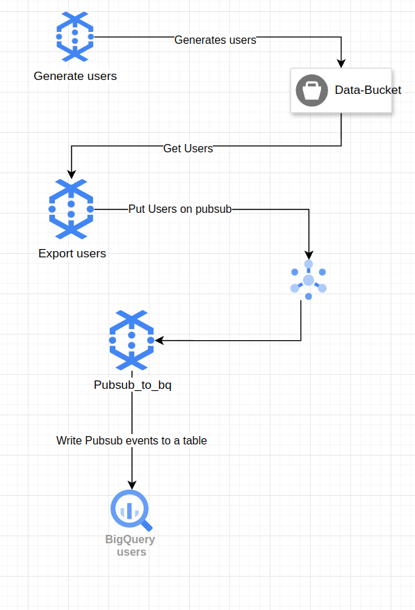

# User Data Pipeline

This project contains two main components:

1. `GenerateUsers`: Generates user data and writes it to a Google Cloud Storage (GCS) bucket.
2. `ExportUserData`: Reads user data from a GCS bucket and processes it.


## The Architecture



## Prerequisites

- Java 8 or higher
- Maven
- Google Cloud SDK (for GCS access)
- Set up authentication for Google Cloud (e.g., using a service account key)

## How to Run

### Generate Users local

1. Run the `GenerateUsers` on direct runner pipeline:
    ```sh 
      mvn compile exec:java -Dexec.mainClass=com.indritvaka.GenerateUsers \
         -Dexec.args="--outputFile=gs://your-bucket/path/to/output \
         --numUsers=100"
    ```

   > Note pls replace `gs://your-bucket/path/to/output` with your GCS bucket path.

### Export User Data

1. Create a pubsub topic:
    ```sh
    gcloud pubsub topics create user-data-topic
    ```

   > Note pls replace `user-data-topic` with your topic name.

   Test if the topic was created successfully:
   ```sh
     gcloud pubsub topics list
   ```


2. Create a subscription for the topic:
   ```sh
     gcloud pubsub subscriptions create your-subscription-id --topic=your-topic-id
   ```
   > Replace your-subscription-id with the desired subscription name, and your-topic-id with the topic you created
   earlier.

3. Create the Biqguery table:

   Next, create the BigQuery table to store the data. You can create a BigQuery table manually with the following
   schema:
   ```sql
   CREATE TABLE `your-project-id.your-dataset-id.user_data` (
    id STRING,
    email STRING,
    name STRING,
    phone STRING,
    address STRING
   );
   ```
   > Replace your-project-id, your-dataset-id, and user_data with your actual project, dataset, and table names.

4. Create a Dataflow job to export the user data to BigQuery:
   ```shell
     gcloud dataflow flex-template run pubsub-to-bq \
      --template-file-gcs-location gs://dataflow-templates-europe-west1/latest/flex/PubSub_to_BigQuery_Flex \
      --region europe-west1 \
      --additional-experiments streaming_mode_exactly_once \
      --additional-user-labels "" \
      --parameters outputTableSpec=indrit-vaka:apache_beam.user_data,inputSubscription=projects/indrit-vaka/subscriptions/user-data-sub,useStorageWriteApi=false,javascriptTextTransformReloadIntervalMinutes=0,stagingLocation=gs://indrit-vaka-staging/temp,maxNumWorkers=2
   ```
   > Replace indrit-vaka:apache_beam.user_data with your project:dataset.table, and
   projects/indrit-vaka/subscriptions/user-data-sub with your project/subscriptions/subscription-name.

5. OPTIONAL Local Test: Run the `ExportUserData` on direct runner pipeline:
    ```sh
    mvn compile exec:java -Dexec.mainClass=com.indritvaka.ExportUserData \
         -Dexec.args="--inputFile=gs://your-bucket/path/to/input \
         --pubSubTopic=projects/your-project-id/topics/your-topic-id"
    ```
   Complete Sample:
    ```sh
    mvn compile exec:java -Dexec.mainClass=com.indritvaka.ExportUserData \
         -Dexec.args="--pubSubTopic=projects/indrit-vaka/topics/user-data-topic"
    ```

### Run the jobs on Dataflow:

Generate a jar file for dataflow runner:

```shell
mvn package -Pdataflow-runner
```

Put this jar file to GCS:

```shell
    gsutil cp target/beam-bundled-0.1.jar gs://indrit-vaka-tmp/beam/jobs/
```

Open the cloud shell and copy the jar file from GCS to the cloud shell:

```shell
   gsutil cp gs://indrit-vaka-tmp/beam/jobs/beam-bundled-0.1.jar .

```

Run the job to generate users using dataflow runner:

```shell
java -cp beam-bundled-0.1.jar \
com.indritvaka.GenerateUsers \
--runner=DataflowRunner \
--project=indrit-vaka \
--region=europe-west1 \
--tempLocation=gs://indrit-vaka-staging/temp/ \
--stagingLocation=gs://indrit-vaka-staging/temp/
```

Run the job to export user data to BigQuery using dataflow runner:

```shell
java -cp beam-bundled-0.1.jar \
com.indritvaka.ExportUserData \
--runner=DataflowRunner \
--project=indrit-vaka \
--region=europe-west1 \
--tempLocation=gs://indrit-vaka-staging/temp/ \
--stagingLocation=gs://indrit-vaka-staging/temp/ \
--pubSubTopic=projects/indrit-vaka/topics/user-data-topic
```
